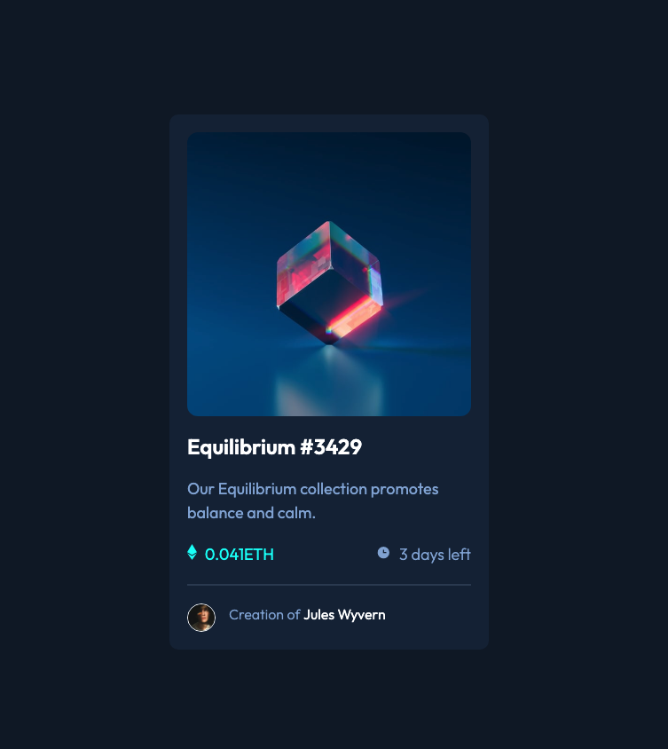

# Frontend Mentor - NFT preview card component solution

This is a solution to the [NFT preview card component challenge on Frontend Mentor](https://www.frontendmentor.io/challenges/nft-preview-card-component-SbdUL_w0U). Frontend Mentor challenges help you improve your coding skills by building realistic projects.

## Table of contents

- [Overview](#overview)
  - [The challenge](#the-challenge)
  - [Screenshot](#screenshot)
  - [Links](#links)
- [My process](#my-process)
  - [Built with](#built-with)
  - [What I learned](#what-i-learned)
  - [Useful resources](#useful-resources)
- [Author](#author)
- [Acknowledgments](#acknowledgments)

## Overview

### The challenge

Users should be able to:

- View the optimal layout depending on their device's screen size
- See hover states for interactive elements

### Screenshot

### Links

- Solution URL: [Frontend Mentor solution](https://www.frontendmentor.io/challenges/nft-preview-card-component-SbdUL_w0U/hub/nft-preview-card-component--YD1VjT2pf)
- Live Site URL: [Live site at Netlify](https://nft-card-f4e946.netlify.app/)

## My process

### Built with

- Semantic HTML5 markup
- CSS custom properties
- Flexbox
- CSS Grid
- BEM
- SASS

### What I learned

I learned how to use the css ::after selector in order the image hover effect

### Useful resources

- [@correlucas solution](https://www.frontendmentor.io/solutions/nft-preview-card-vanilla-css-custom-design-and-hover-effects-zVKSAE5IXI) - Lucas solution to the NFT preview card challenge really helped me to figure out how add the color overlay and icon on imgae hover

## Author

- Frontend Mentor - [@JGedd](https://www.frontendmentor.io/profile/JGedd)
- Twitter - [@John_geddis](https://twitter.com/john_geddis)

## Acknowledgments

Thanks again to Lucas for his solution for to the NFT Preview Card Challenge, it really help me figure out this challenge.
